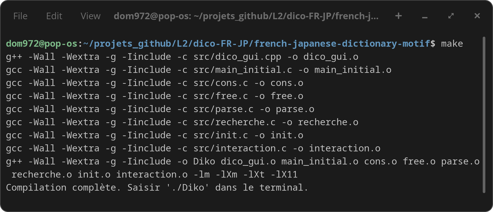
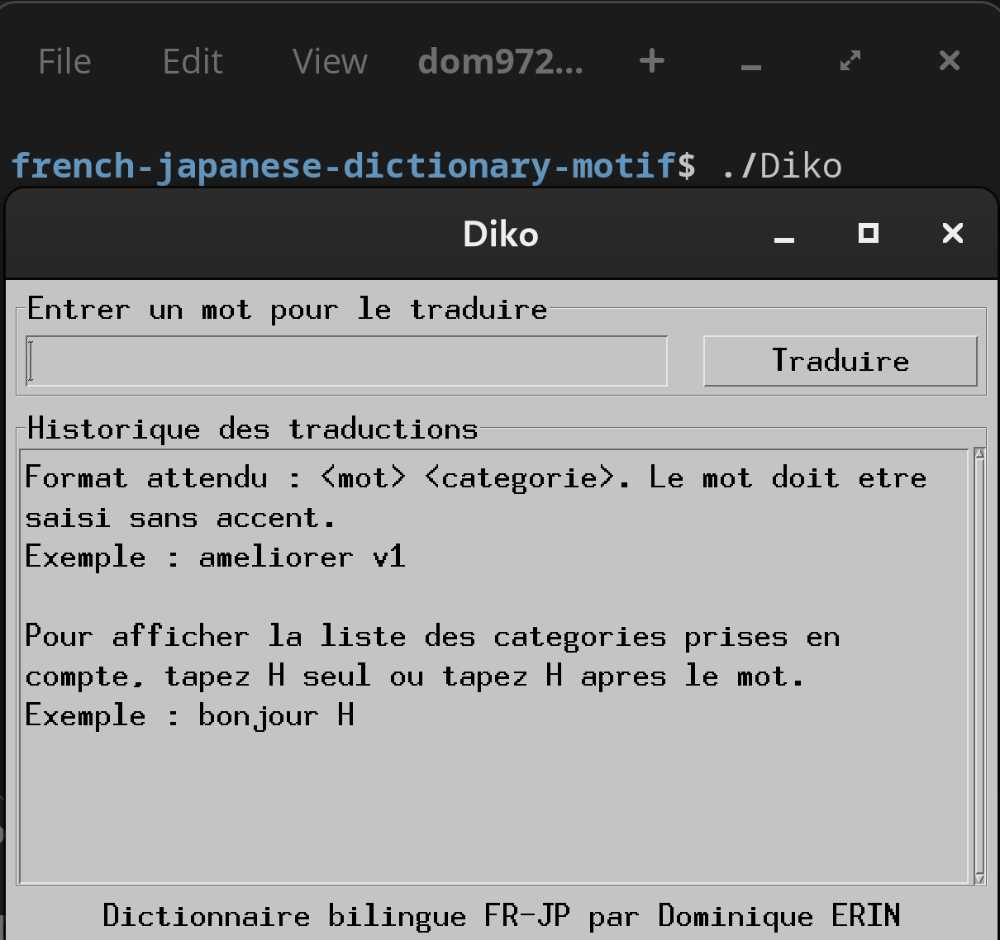
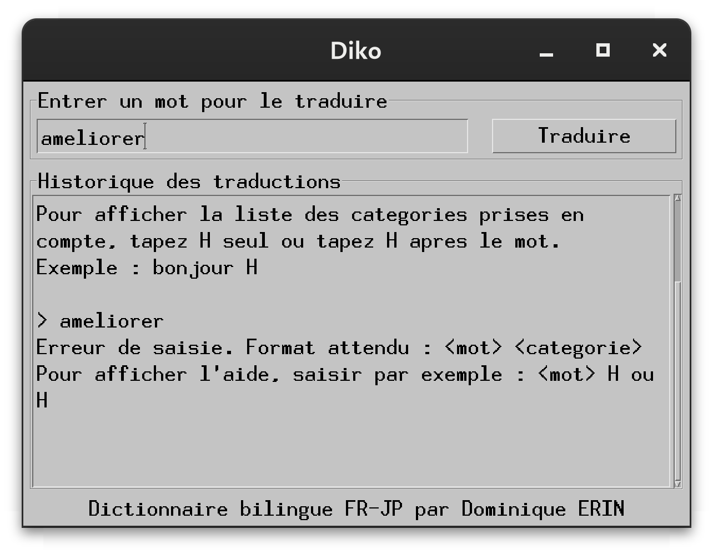
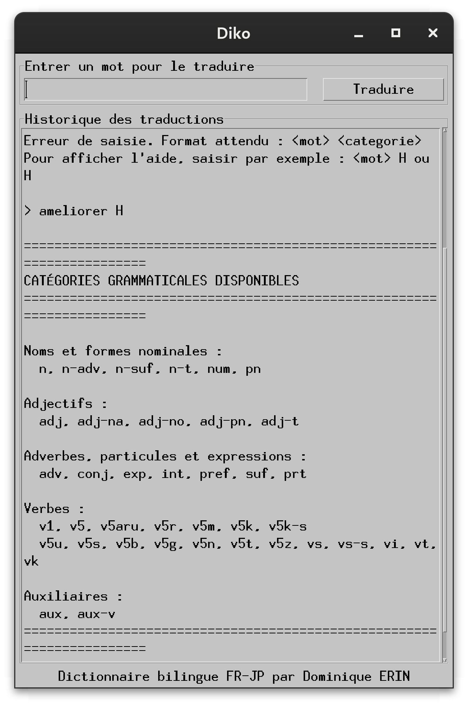
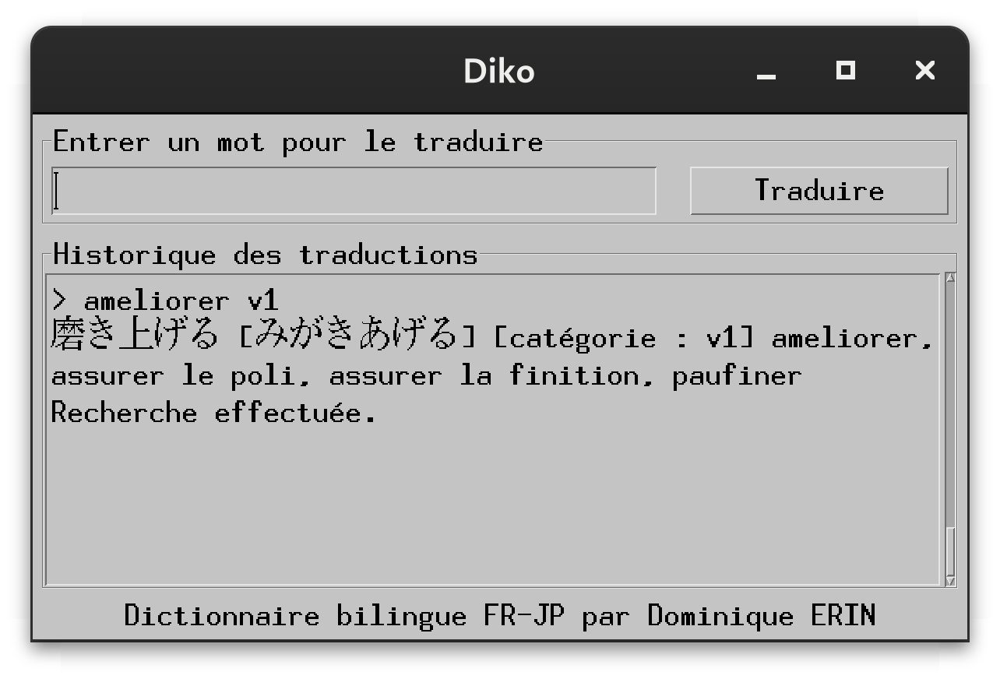
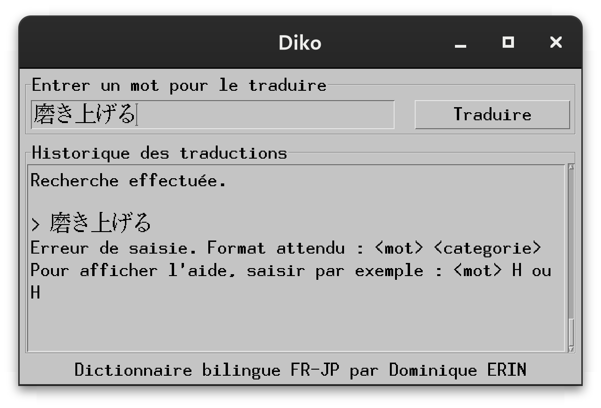
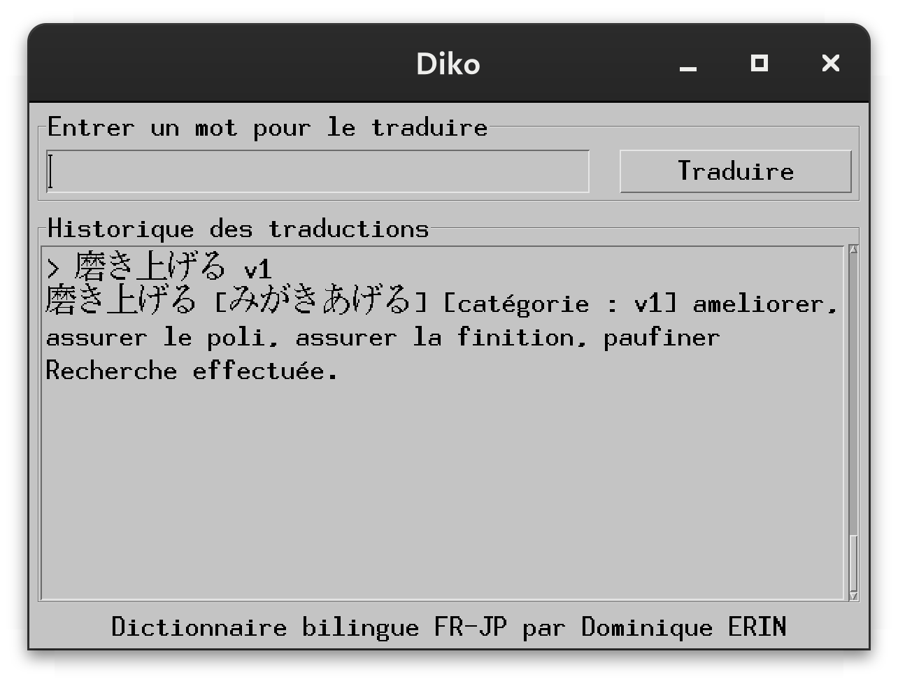
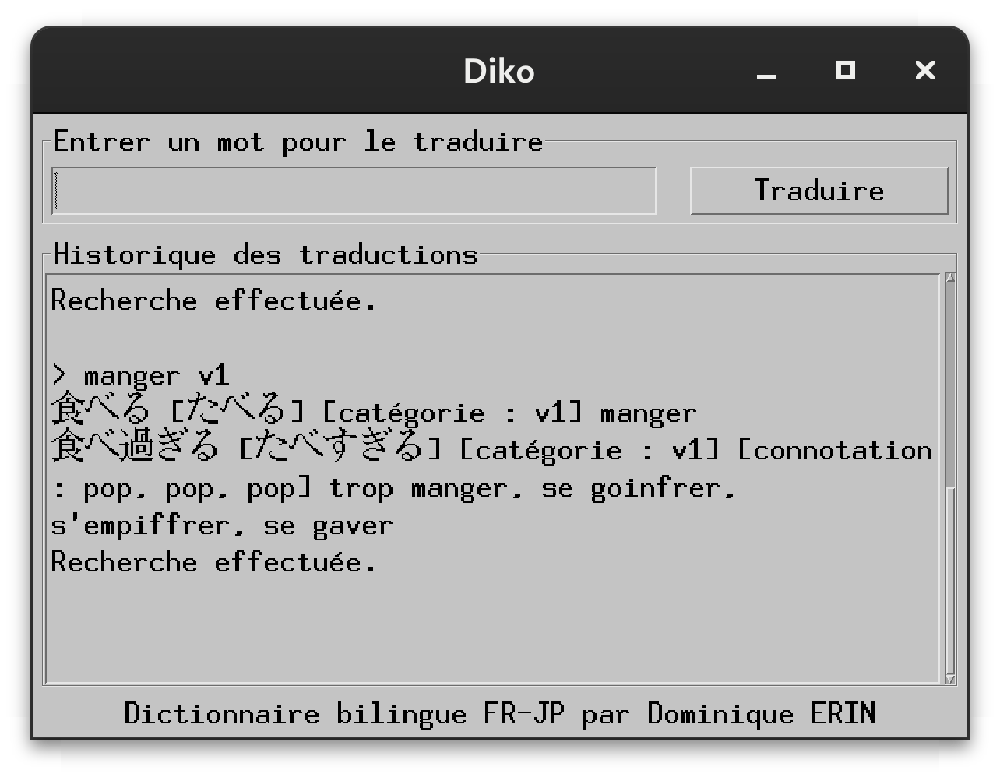
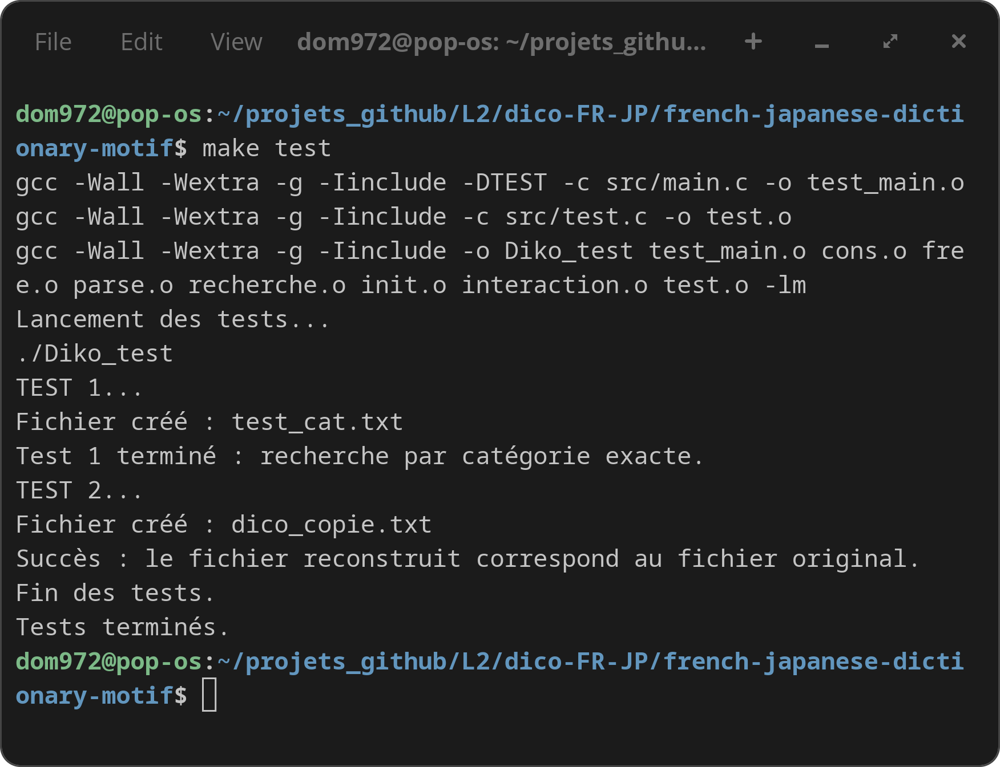

# Diko - French-Japanese Bilingual Dictionary with a Motif Interface

This project is a French-Japanese bilingual dictionary written in C/C++, with a graphical interface built with Motif.

It was carried out by **Dominique ERIN** as part of the Algorithms and Data Structures course at **Université Paris 8**, and was graded by Professor **Larbi BOUBCHIR**.

The project is based on a course in algorithms and data structures written by Professor Emeritus **Gilles Bernard** from Université Paris 8. Some parts of the project come from an initial Mini-Lisp / Motif codebase written by Gilles Bernard. The original comments and license notices were preserved in the source files.

When the program starts, the user can enter a French or Japanese word together with its grammatical category. The result is displayed in a graphical history area.

Unlike Python, C does not provide a built-in dictionary type comparable to Python's `dict`. For this reason, the project uses custom C structures and Lisp-like linked lists to store and access the dictionary entries.

The dictionary file used in this project comes from FJDICT, created by J.-M. Desperrier and other contributors in 2002. Its general structure is the following:

```text
(((kanji) ([furigana]) (category)) ((French translation) ((usage)(additional French translation))) (identifier))
```
## French documentation

A French version of this documentation is available here:

[LISEZ-MOI.md](LISEZ-MOI.md)

## Linked list and structure declaration

After identifying the structure of the dictionary file, we created the following four C structures. These structures bring together the elements that make up one dictionary entry.

1. The `Nature` structure contains the grammatical category of a word, its usage or connotation, and its identifier:

```C
typedef struct Nature {
    // Attributs de nature : catégories grammaticales et usages
    list categorie_list; // liste de chaînes de caractères
    list usage_list;     // liste de chaînes de caractères
    int code;            // identifiant de la ligne
} Nature;
```

2. The `Base` structure contains the main form of a word. For a Japanese word, this main form can be the kanji form, and the original form can be the furigana. For a French translation, the same structure can also be used to store the French form and its complementary information. The structure also contains the `Nature` attributes:

```C
// Structure de Base - contient les listes pour les chaînes de caractères forme/original
typedef struct Base {
    list forme;    // Une liste où le 'car' est la chaîne de caractères (Kanji, mot français)
    list original; // Une liste où le 'car' est la chaîne de caractères (Furigana, traduction complémentaire)
    Nature nat;    // Attributs de nature
} base;
```

3. The `Fr` structure represents one French translation of a Japanese word. It contains the French translation, its usages, and possible complementary translations. It also contains a pointer to the next French translation:

```C
// Structure Fr (traduction française) - Structure pour la forme française
typedef struct Fr {
    base traduction; // Contient la forme, l'original et les usages pour une traduction
    struct Fr *cdr;  // Pointeur vers la traduction suivante
} *traductions;
```

4. The `Entree` structure represents one dictionary entry. It contains the Japanese form of the word, the list of French translations, and the identifier attached to the entry:

```C
// Structure Entree - une seule entrée de dictionnaire
typedef struct Entree {
    base forme_japonaise; // Informations sur le mot japonais
    traductions forme_fr; // Une liste de Fr* pour plusieurs traductions françaises
    int id;               // Identifiant de l'entrée
} entree;
```

## Linked list access

We access the linked lists with Lisp-like macros inspired by `car` and `cdr`.

In Lisp, `car` gives access to the first element of a list. In this project, the `lisp_car` macro gives access to the content of the current list node:

```C
#define lisp_car(x) ((x)->car) // Accède au contenu du nœud de liste
```

The `cdr` function gives access to the rest of the list. In this project, the `lisp_cdr` macro gives access to the next node of the list:

```C
#define lisp_cdr(x) ((x)->cdr) // Accède au nœud suivant de la liste
```

Before accessing the elements of an `entree`, we define Lisp-like macros that make the code easier to read.

1. Access to the Japanese base:

```C
#define jp_base(e) ((e)->forme_japonaise) // Accède à la Base japonaise
```

2. Access to the French translation list:

```C
#define liste_trad_fr(e) ((e)->forme_fr) // Accède à la liste de traductions françaises
```

3. Access to the entry identifier:

```C
#define entree_id(e) ((e)->id) // Accède à l'identifiant de l'entrée
```

Then we declare the following Lisp-like macros to access the internal fields of the structures.

1. Access to a `base` structure, using `b` as the name of the base variable:

```C
#define base_form(b) (b).forme
#define base_original(b) (b).original
#define base_categories(b) (b).nat.categorie_list
#define base_usages(b) (b).nat.usage_list
```

2. Direct access to a French translation through a `Fr*` pointer:

```C
// Accès aux champs d'une Fr*
// Par exemple, fr_ptr peut être obtenu avec lisp_car sur une liste de traductions françaises
#define fr_translation_base(fr_ptr) ((fr_ptr)->traduction)
```

3. Access to the Japanese word, for example the kanji form. Here, `e_ptr` is a pointer to an `Entree` structure:

```C
// Accès à un mot japonais (Kanji)
// 'forme' est une list dont le car contient la chaîne de caractères.
#define form(e_ptr) ((string)lisp_car(base_form(jp_base(e_ptr))))
```

4. Access to the pronunciation of a Japanese word, for example the furigana. Here again, `e_ptr` is a pointer to an `Entree` structure:

```C
// Accès à l'original (Furigana)
#define original(e_ptr) ((string)lisp_car(base_original(jp_base(e_ptr))))
```

5. Access to the list of French translations of a Japanese word:

```C
// Accès aux traductions françaises
// Retourne une liste de traductions.
#define traductions(e_ptr) liste_trad_fr(e_ptr)
```

6. Access to the grammatical categories of a Japanese word:

```C
// Accès aux catégories grammaticales
#define cat(e_ptr) base_categories(jp_base(e_ptr))

#define nil NULL
```

This project was carried out by **Dominique ERIN**, under the supervision of Professor **Larbi BOUBCHIR** at **Université Paris 8**.

---

## 📚 NOTES, CREDITS AND DATA

This project was carried out as part of the course **Algorithms and Data Structures**, written by Professor **Gilles Bernard**.

Some parts of the project come from an initial Mini-Lisp / Motif code written by **Gilles Bernard**. The original comments and notices were kept in the source files.

The dictionary file used by the program comes from **FJDICT**:

```text
FJDICT 20DEC02 V00-001-PR3
Dictionnaire francais-japonais version preliminaire 3
Copyright J.-M. Desperrier + autres - 2002
```

The content of the dictionary is not the property of the author of this project. Any redistribution of the dictionary file must keep its original copyright notice.

Original header of the dictionary file:

```text
0000000 /FJDICT 20DEC02 V00-001-PR3/Dictionnaire francais-japonais version preliminaire 3/Copyright J.-M. Desperrier + autres - 2002/
```

The work done in this project mainly concerns:

- loading the dictionary file;
- parsing the lines of the dictionary;
- building an internal search structure;
- searching by word and grammatical category;
- adding a graphical interface with Motif;
- adding a translation history area;
- adding tests.

---

## ⚙️ PROGRAM COMPILATION

To compile the graphical dictionary, use the following command:

```bash
$ make
```



---

## 🚀 PROGRAM LAUNCH

To run the graphical application:

```bash
$ ./Diko
```



---

## 🧪 INPUT ERROR EXAMPLE

If the user only enters a word without a grammatical category:

```text
ameliorer
```

the program displays an error message indicating the expected format.



---

## 🧭 DISPLAY OF THE CATEGORY HELP

To display the list of available grammatical categories, the user can enter:

```text
H
```

or enter `H` after a word:

```text
ameliorer H
```



---

## 🔎 SEARCH FOR A FRENCH-JAPANESE TRANSLATION

Example with the verb:

```text
ameliorer v1
```



---

## 🇯🇵 SEARCH WITH A JAPANESE ENTRY

The interface also allows the user to enter a Japanese entry that exists in the dictionary.

Example:

```text
磨き上げる
```

Without a grammatical category, the program displays a format error.



With the grammatical category:

```text
磨き上げる v1
```

the program finds the corresponding entry.



---

## 🔎 ANOTHER SEARCH EXAMPLE

Example with the verb:

```text
manger v1
```



---

## 🧪 PROGRAM TESTS

The project contains a test target in the `Makefile`.

To run the tests:

```bash
$ make test
```



The tests check:

- the search by grammatical category;
- the creation of the file `test_cat.txt`;
- the reconstruction of the dictionary file into `dico_copie.txt`;
- the comparison between the original file and the reconstructed file.

Example output:

```text
TEST 1...
Fichier créé : test_cat.txt
Test 1 terminé : recherche par catégorie exacte.
TEST 2...
Fichier créé : dico_copie.txt
Succès : le fichier reconstruit correspond au fichier original.
Fin des tests.
Tests terminés.
```

---

## 📄 DESCRIPTION OF THE MAIN FILES

<dl>
  <dt><code>src/dico_gui.cpp</code></dt>
  <dd>Main program of the graphical version. It creates the Motif interface, loads the dictionary, gets the user input, and displays the results in the history area.</dd>

  <dt><code>include/dico_gui.h</code></dt>
  <dd>Main header file of the graphical version. It groups the includes needed by the Motif program.</dd>

  <dt><code>src/main_initial.c</code></dt>
  <dd>Contains functions from the initial version of the dictionary.</dd>

  <dt><code>src/parse.c</code></dt>
  <dd>Parses the lines of the dictionary file in order to extract words, readings, categories, and translations.</dd>

  <dt><code>src/recherche.c</code></dt>
  <dd>Contains the search functions used in the dictionary.</dd>

  <dt><code>src/interaction.c</code></dt>
  <dd>Contains, in particular, the display of the available grammatical categories.</dd>

  <dt><code>src/test.c</code></dt>
  <dd>Contains the test functions of the program.</dd>

  <dt><code>Dico/fj_utf8.txt</code></dt>
  <dd>French-Japanese dictionary file used by the program.</dd>

  <dt><code>Makefile</code></dt>
  <dd>Automates the compilation of the main program and the tests.</dd>
</dl>

---

## 📦 DEPENDENCIES

The project requires:

- `gcc`;
- `g++`;
- `make`;
- Motif / OpenMotif libraries;
- X11 libraries.

On GNU/Linux systems, the dependencies can be installed with:

```bash
$ sudo apt install build-essential libmotif-dev libx11-dev
```

---

## 🧹 CLEANING COMPILED FILES

To remove object files, the main executable, the test executable, and the files generated by the tests:

```bash
$ make clean
```

---

## 👤 AUTHOR

Project carried out by:

```text
Dominique ERIN
```


Graphical interface built with:

```text
Motif
```

---

